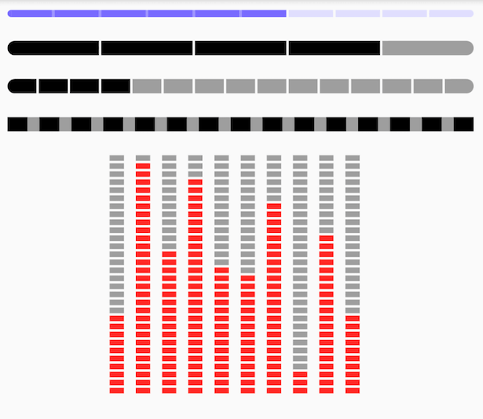

# IntervalProgressBar

A interval progress widget for Flutter.

## Preview



## Features

- Horizontal
- Vertical
- Interval Progress
- Colorful

## Getting Started

### Preview Sample Code

```dart
Center(
   child: Row(
       mainAxisAlignment: MainAxisAlignment.center,
       children: [10, 29, 18, 27, 16, 15, 24, 3, 20, 10]
           .map<Widget>((i) {
         return Padding(
             padding: EdgeInsets.only(right: 10),
             child: IntervalProgressBar(
                 direction: IntervalProgressDirection.vertical,
                 max: 30,
                 progress: i,
                 intervalSize: 2,
                 size: Size(12, 200),
                 highlightColor: Colors.red,
                 defaultColor: Colors.grey,
                 intervalColor: Colors.transparent,
                 intervalHighlightColor: Colors.transparent,
                 reverse: true,
                 radius: 0));
       }).toList()),
)
```

### Property

|Property|type|note|
|:---|:---|:---|
|direction|`enum`| ProgressBar's direction, support `vertical` and `horizontal` |
|max|`int`| count of default blocks |
|progress|`int`| count of highlight blocks |
|intervalSize|`int`| size of interval blocks. when `vertical` direction, means *height*, when `horizontal` direction, means *width* |
|size|`Size`| size of this widget |
|highlightColor|`Color`| color of highlight blocks |
|defaultColor|`Color`| color of default blocks |
|intervalColor|`Color`| color of default intervals |
|intervalHighlightColor| `Color`|color of intervals which between highlight blocks |
|reverse|`bool`||
|radius|`int`||